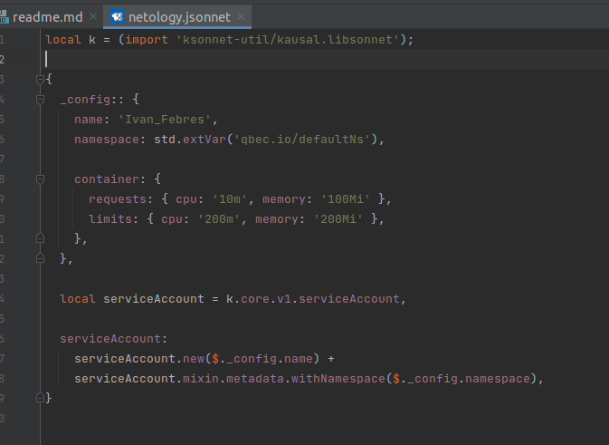
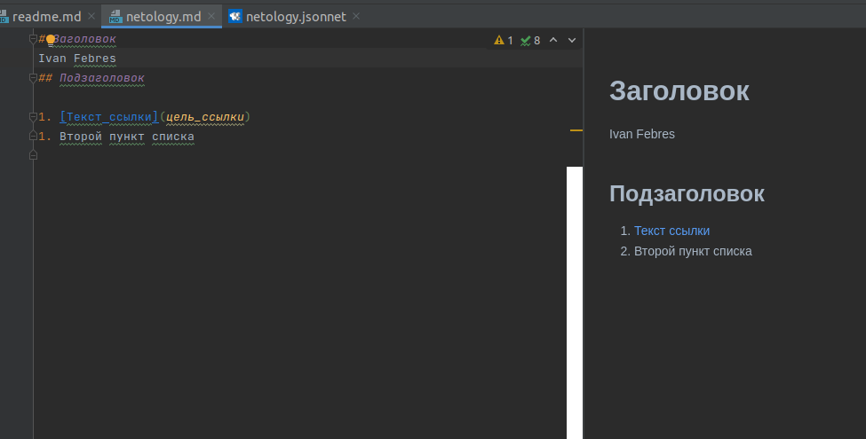
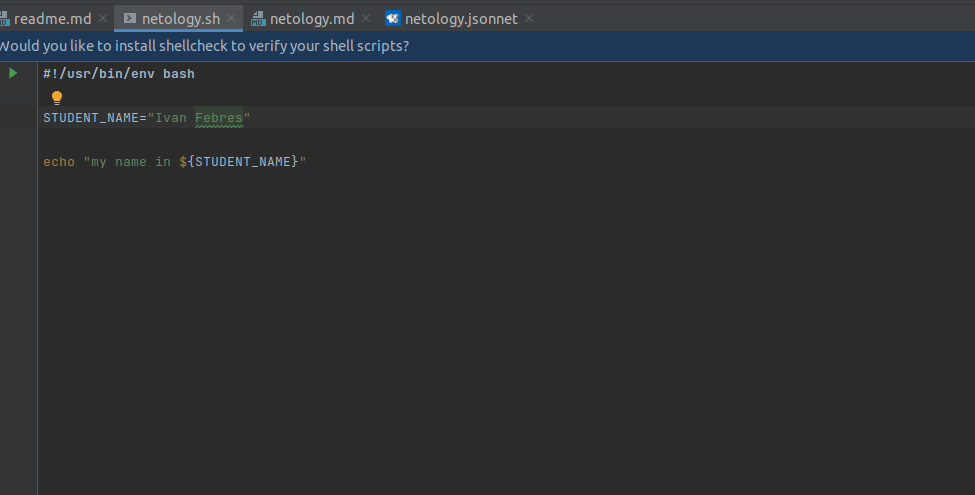
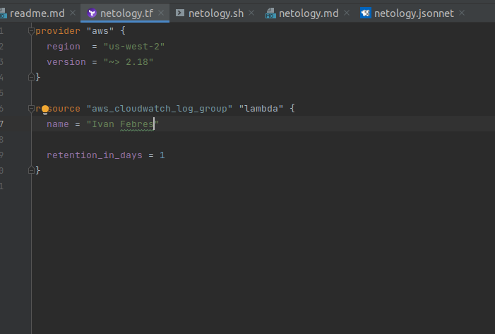
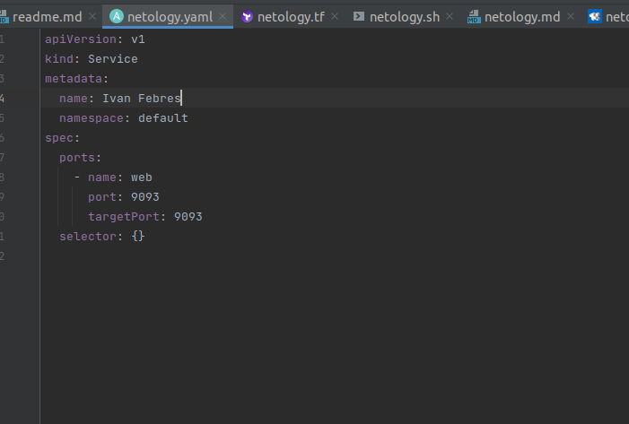

Задание 1

JSONNET

Markdown

Bash

Terraform

Yaml

Задание 2

1. Сбор и анализ требований.
На этом этапе участвуют менеджер и команда разработчиков. Определяются цели и потребности бизнеса.

2. Проектирование. Бизнес и разработчики, которые взаимодействуют между собой
в ходе определения требований к приложению или сервису и реализации этих требований в проекте.

3. Разработка. Реализация требований. Команда разработки пр непосредственном участии бизнеса выполняет реализацию проекта.

4. Тестирование. Тестировщики при участии команды разработки проводят тестирование (функциональное, нагрузочное). 
Devops отвечает за непрерывную доставку приложений на тестовые среды

5. Внедрение. Devops отвечает за развертывание приложения в продуктивной среде.

6. Сопровождение. Devops совметсно с разработчкима организовывает мониторинг и непрерыную доставку обновлений на прод. 

7. Менеджер отвечает за обратную связь с бизнесом и корректировки требований к функционалу.